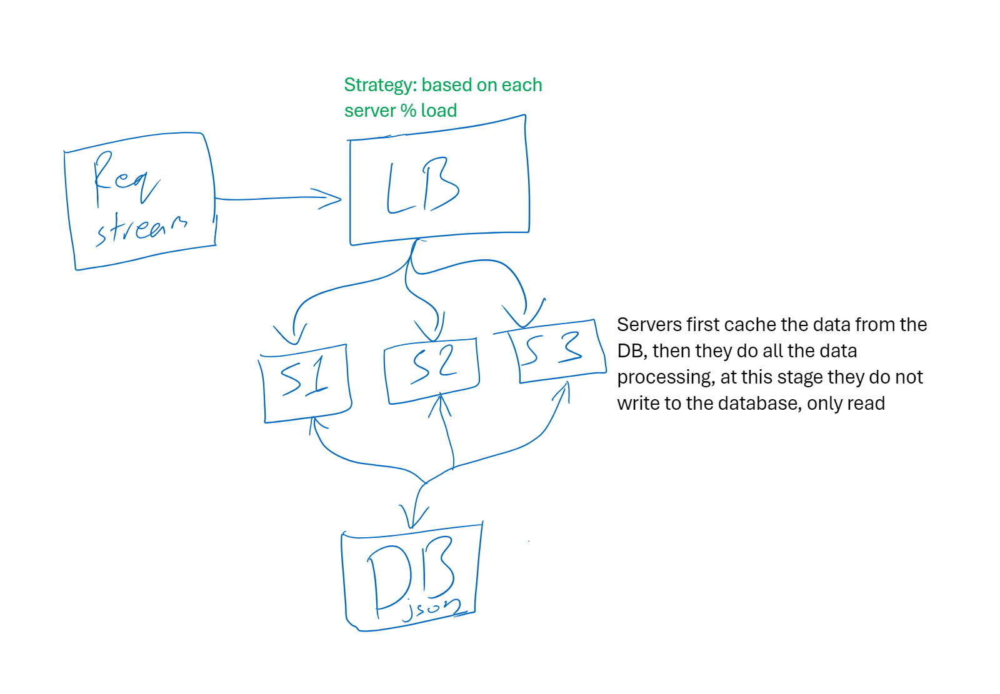
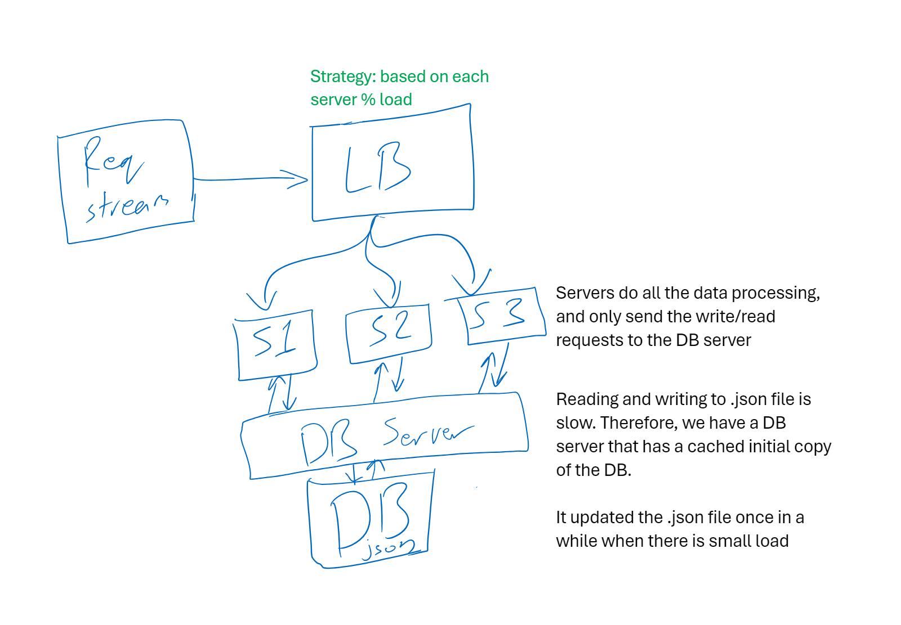

# Ticket selling system

### Quick start
```bash
python load_balancer.py
```

### Flow chart
This project does the load balancing based on the % of max the server is running at


### Point of failure
Data concurrency issue:
We have a potential failure point at the database.
It is a simple .json file.
The servers get the initial value when initialized and cache it.
Then they try to open the .json file to write, and when it's already open by another server it keeps trying until it succeeds.
But as you can see we have a problem! When a server opens the database  it locks it.
Another point is that when it unlocks it and another server opens it, it is not aware of the new changes done by the first server.

### Suggested improvement
To use a different type of database such as RDBMS (Relational database management system Software) or somehting like Redis that has caching.


And we may also add another layer for database requests managment:
